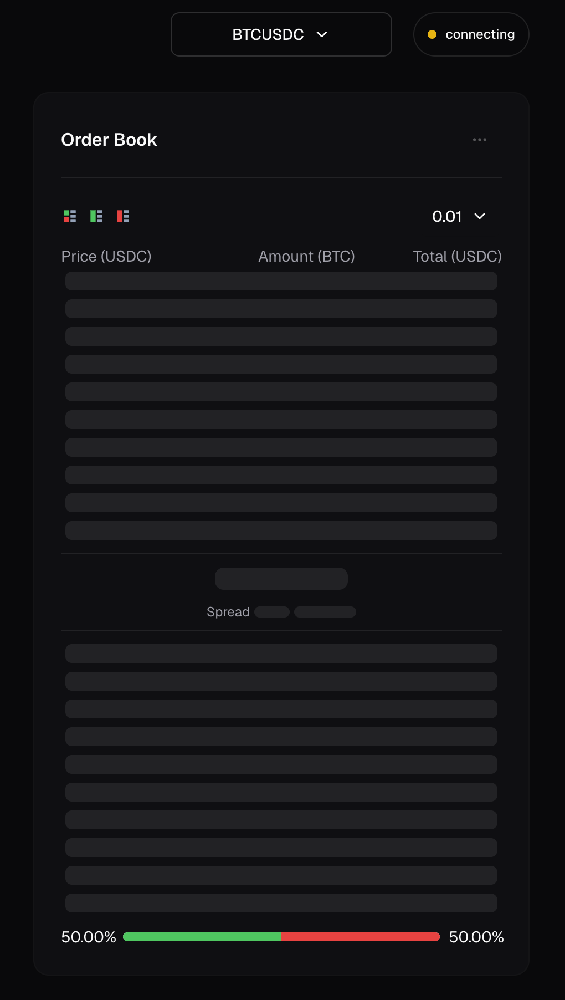
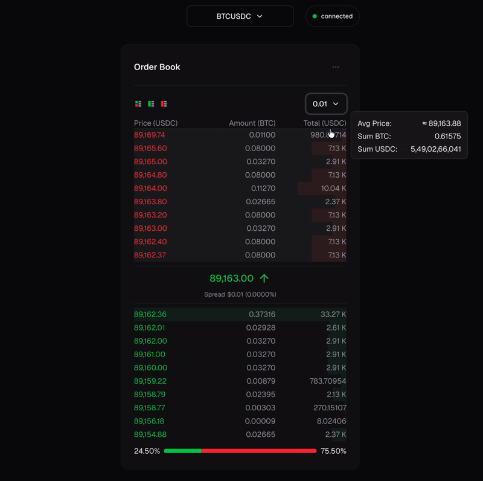
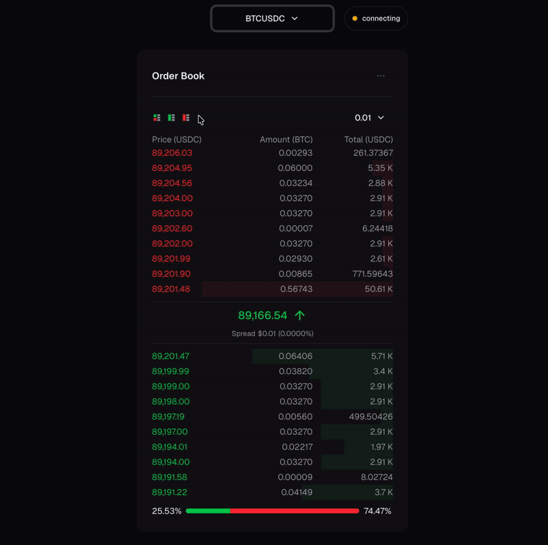
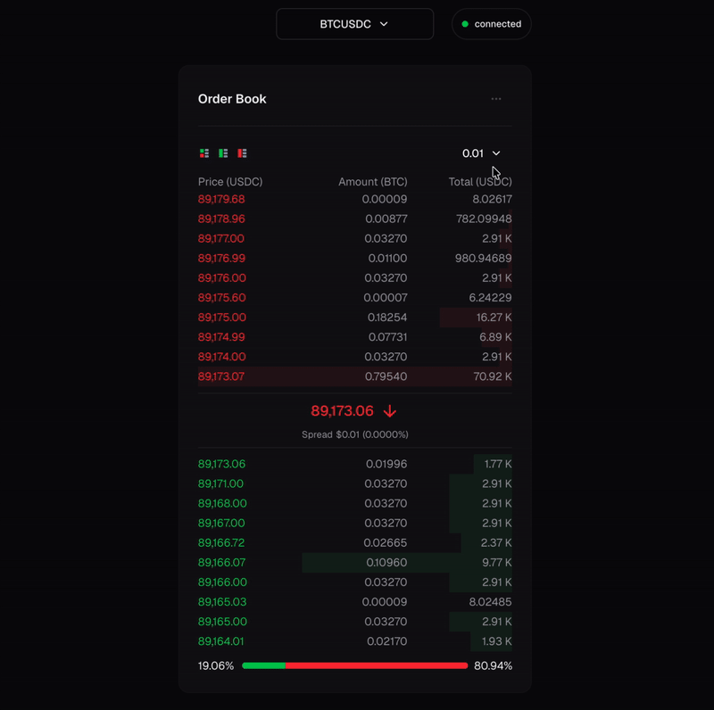
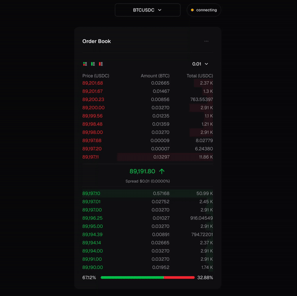
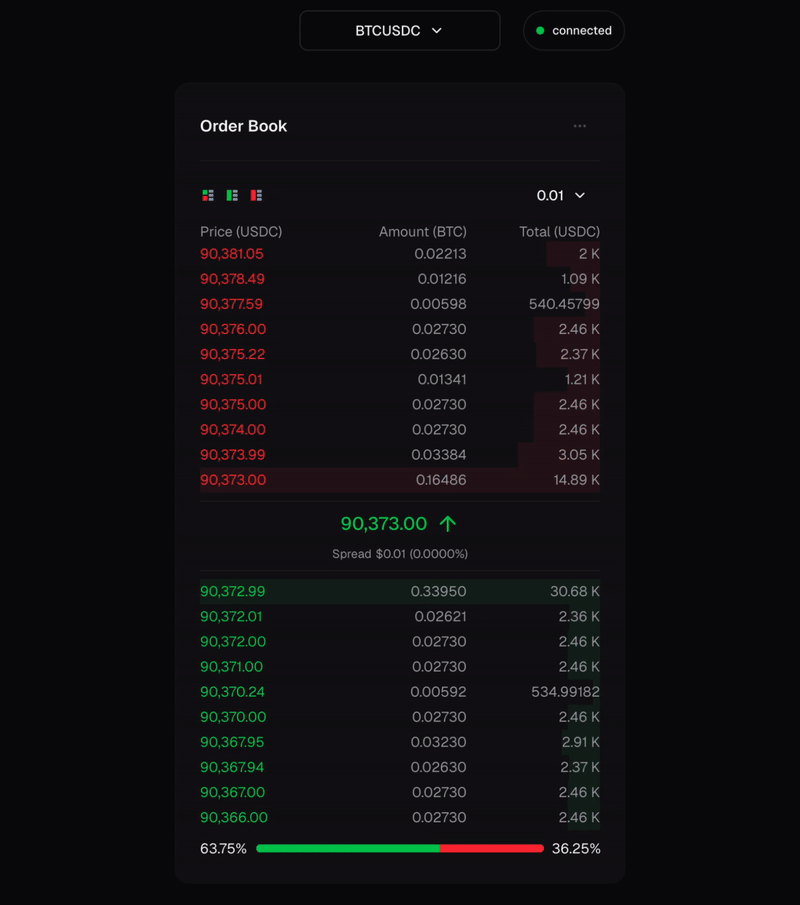

# Crypto Order Book


## Overview

Real-time order book and trade stream built with Next.js and Binance WebSockets.
Focuses on resilience, performance, and clean connection management.

## Features

- Real-time order book (bids / asks)
- Live trade stream
- WebSocket retry with backoff
- Periodic health-check reconnect
- Tab visibility & network awareness
- Throttled UI updates
- Graceful disconnect handling
- Non-blocking UI state (order book & trades independent)

## Architecture

- Adapter-based WebSocket abstraction
- Custom React hooks for order book and trades
- Explicit connection state machine (`connecting | connected | disconnected`)
- No server-side WebSocket proxy (client-only)

## Environment Variables

NEXT_PUBLIC_ENV=development
NEXT_PUBLIC_BINANCE_WS_URL=wss://stream.binance.com:9443/ws/
NEXT_PUBLIC_BINANCE_EXCHANGE_INFO_URL=https://api.binance.com/api/v3/exchangeInfo
NEXT_PUBLIC_BINANCE_DEPTH_LEVEL=20
NEXT_PUBLIC_BINANCE_UPDATE_MS=100

## UI States

- Skeleton rows on initial load
- Persistent last-known data on reconnect
- Connection status badge (non-intrusive)
- Mobile-friendly indicators

## Known Limitations

- Binance WS supports only specific update intervals (100ms / 1000ms)
- WebSocket stability depends on Binance availability

## Screenshots / Demo









## Configuration

| Variable                 | Default | Description                                  |
| ------------------------ | ------- | -------------------------------------------- |
| NEXT_BINANCE_DEPTH_LEVEL | 20      | Number of bids/asks per WS message           |
| NEXT_BINANCE_UPDATE_MS   | 100     | Update frequency in milliseconds             |
| throttle                 | 500     | Delay to update ui in milliseconds           |
| maxRetries               | 5       | Number of retry attempts before health check |
| baseRetryDelay           | 500     | Base delay (ms) for exponential backoff      |
| healthRetryDelay         | 10000   | Interval for periodic health check           |

## Notes

- Binance WebSocket may occasionally stop or slow down; hook handles reconnects.
- Throttle ensures UI doesn’t update too frequently.
- Trades and order book work independently; one can fail while the other keeps updating.

## Installation

1. Clone the repo:

```bash
 git clone <repo-url>
 cd <repo-folder>
```

2. Install dependencies:

```bash
npm install
```

3. Set environment variables (optional, with defaults):

```bash
NEXT_BINANCE_DEPTH_LEVEL=20
NEXT_BINANCE_UPDATE_MS=100
```

4. Start development server:

```bash
npm run dev
# or
yarn dev
# or
pnpm dev
# or
bun dev
```

This is a [Next.js](https://nextjs.org) project bootstrapped with [`create-next-app`](https://nextjs.org/docs/app/api-reference/cli/create-next-app).

Open [http://localhost:3000](http://localhost:3000) with your browser to see the result.
